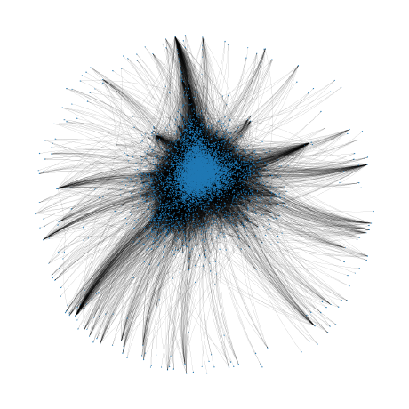
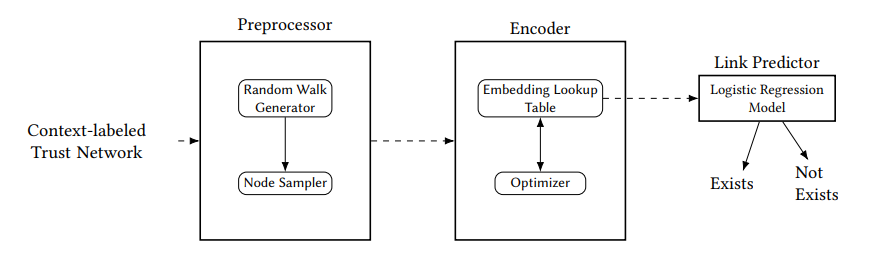
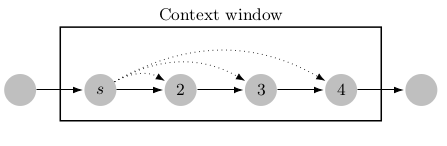

<p align="center">
  
</p>

<div align="center">
  <h1>CS-Trust2Vec: Context-Sensitive Trust Network Embedding Model</h1> 
</div>

<p align="center">
  <a href="https://github.com/oonat/CS-Trust2Vec/blob/main/cstrust2vec.pdf">Paper</a> | 
  <a href="https://github.com/oonat/CS-Trust2Vec/blob/main/poster.pdf">Poster</a> 
</p>

<br />
<br />

## About the Project
CS-Trust2Vec is a context-sensitive trust network embedding model. It is designed for unsigned context-labeled trust networks which are directed graphs that store the context information of the trust relationships as edge attributes.

The model consists of three modules: Preprocessor, Encoder, and Link Predictor. The architecture of the model can be seen in the figure below.

<p align="center">
  
</p>

### Preprocessor
The preprocessor is used for two tasks,
1. Generating biased random walks 
2. Producing positive and negative sample multisets for each node

Random walks are generated based on the similarity of the context. The next edge in a random walk is randomly chosen from a non-uniform probability distribution whose weights are similarity scores between the context label of the previous edge and the candidate edges.

There are three different similarity measures for the generation of random walks: cosine, euclidean, and Jaccard similarities. The desired similarity metric can be selected by using the **--sim-metric** option. Furthermore, the uniform option is also possible for those who do not want to generate biased random walks.

The module has a context window that traverses the random walks, one node at a time. In each step, the nodes in the context window are added to the positive sample set of the first node. For instance, In the figure given below, nodes 2, 3, and 4 will be added to the positive sample set of node s.

<p align="center">
  
</p>

After the generation of the positive sample sets, for each positive sample of node u, a predetermined number of negative samples are randomly selected from the nodes that are not neighbors and not in the positive sample set of node u.

### Encoder
For each node, the low dimensional vectorial representation of the node is stored in a matrix named Embedding Lookup Table. Each embedding consists of four different features: outward/inward latent features and outward/inward context tendency features.

The Encoder module optimizes the embeddings using these positive and negative sample sets generated by the Preprocessor module.


### Link Predictor
Link Predictor is a logistic regression model used to measure the quality of the generated embeddings. It takes the concatenation of the node embeddings as input and predicts whether there is a relationship between the given node pairs or not.


## Getting Started

### Prerequisites

The model requires several Python libraries that can be installed by following the instructions provided in the Installation section. Since the model is designed for context-labeled trust networks, a NetworkX graph that contains context information has to be provided to run the model.

### Installation

Before installing the required libraries, It is recommended to create a virtual environment.

The libraries required for the project are listed in the **requirements.txt** file. To download and install the necessary libraries
```sh
pip install -r requirements.txt
```


### Usage

Navigate into the /src directory
```sh
cd src
```

Execute the Python file
```sh
python cstrust2vec.py [options]
```

This command automatically runs the model with the provided options and generates node embeddings for the given context-labeled trust network. Node embeddings are stored in the **/embeddings** directory.

Several options can be used with the module,

```
--graph-path         STRING   Path to the context-labeled trust networks         Default=="./data/networkx_graph.pkl"
--ldim               INT      Dimension of latent feature vector                 Default==48
--ctdim              INT      Dimension of context tendency feature vector       Default==28
--n                  INT      Number of noise samples                            Default==3
--window-size        INT      Length of the context window                       Default==5
--num_walks          INT      Walks per node                                     Default==20
--walk_len           INT      Length per walk                                    Default==10
--workers            INT      Number of threads used for random walking          Default==4
--epoch              INT      Number of epochs for optimization                  Default==5
--sim-metric         STRING   Similarity measure used in random walk generation  Default=="cosine"
--learning-rate      FLOAT    Leaning rate                                       Default==0.02
--split-seed         INT      Random seed used in k-fold splitting               Deafult==2
```

To learn about all options, type **--help**.

## Dataset
Due to the lack of social network datasets that have context information in the literature, we curated our own dataset by scraping a Turkish online social media platform named [Ekşi Sözlük](https://eksisozluk.com/). Although all the users in the dataset are anonymized, we chose not to share the data set in the repository to restrict its use to academic studies only. If you would like to use the data set for academic purposes, please email us at onat.ozdemir@metu.edu.tr.

## Acknowledgement
In this project, we benefit from "[Social trust Network Embedding](https://ieeexplore.ieee.org/document/8970926)", Pinghua Xu, Wenbin Hu, Jia Wu, Weiwei Liu, Bo Du, and Jian Yang, ICDM 2019 and the following GitHub repo: https://github.com/WHU-SNA/STNE.
